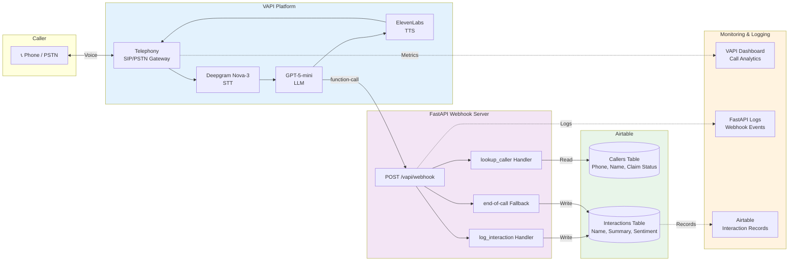
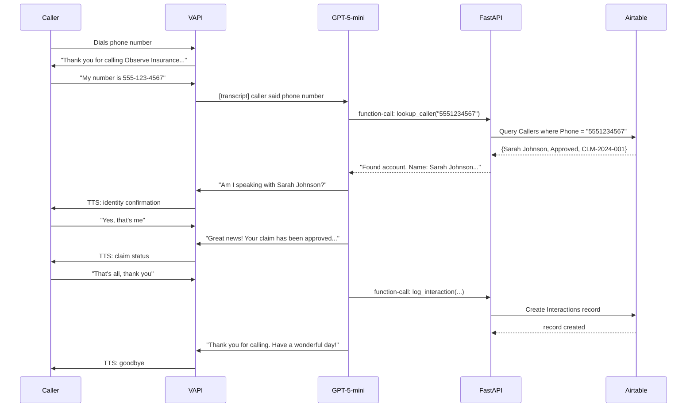
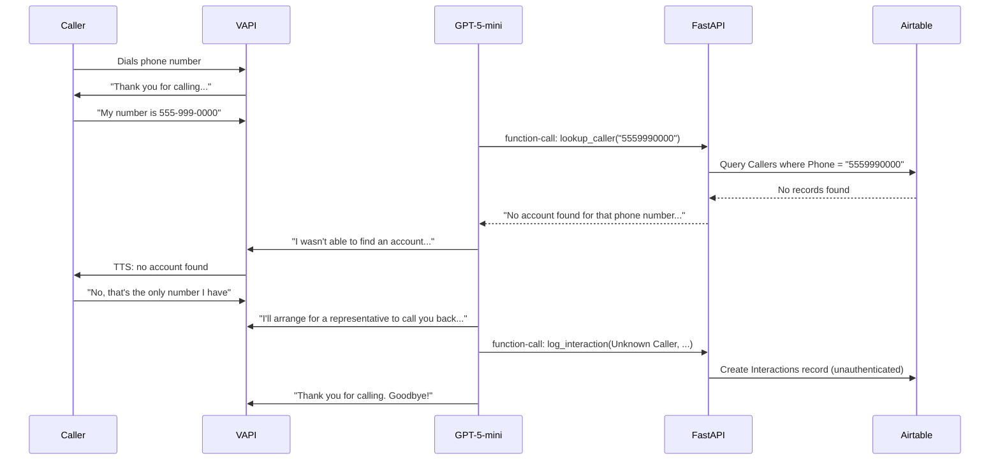

# Solution Architecture

## System Architecture Diagram

## Component Details

### Voice Pipeline (VAPI)
| Component | Technology | Purpose |
|-----------|-----------|---------|
| Telephony | VAPI SIP/PSTN | Receives inbound calls, manages phone numbers |
| STT | Deepgram Nova-3 | Real-time speech-to-text with low latency |
| LLM | GPT-5-mini | Conversation logic, tool calling, response generation |
| TTS | ElevenLabs | Natural, human-like voice synthesis |

### Webhook Server (FastAPI)
| Endpoint | Trigger | Action |
|----------|---------|--------|
| `POST /vapi/webhook` | Every VAPI event | Routes to appropriate handler |
| `lookup_caller` handler | LLM calls tool | Queries Airtable Callers table by phone |
| `log_interaction` handler | LLM calls tool at end of call | Writes record to Airtable Interactions table |
| `end-of-call` handler | Call ends | Fallback logging if LLM didn't log |
| `GET /health` | Health checks | Returns service status |

### Data Layer (Airtable)
| Table | Access | Schema |
|-------|--------|--------|
| Callers | Read | First Name, Last Name, Phone, Claim Status, Claim ID, Policy Number |
| Interactions | Write | Caller Name, Phone, Summary, Sentiment, Timestamp, Authenticated |

### Monitoring Touchpoints
| Point | What's Captured | Where |
|-------|----------------|-------|
| VAPI Dashboard | Call duration, latency, completion rate, transcripts | VAPI web console |
| Webhook Logs | Function call timing, errors, Airtable response times | FastAPI stdout / log aggregator |
| Interaction Records | Every call outcome: who called, what happened, sentiment | Airtable Interactions table |
| Error Logging | Failed lookups, Airtable errors, unknown function calls | FastAPI structured logs |

## Data Flow: Happy Path

## Data Flow: Error Path (Phone Not Found)

