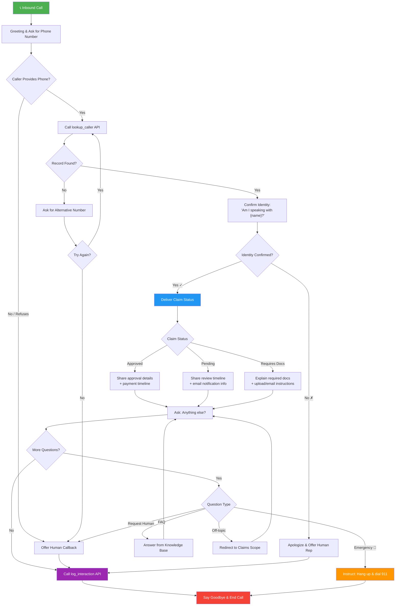

# Conversation Flow

## Voice Flow Chart

## Flow Description

| Step | Action | Integration Point |
|------|--------|-------------------|
| 1. Greeting | Welcome caller, ask for phone number | VAPI TTS → Caller |
| 2. Phone Lookup | Call `lookup_caller` tool | Webhook → Airtable (Callers) |
| 3. Identity Confirmation | Confirm name with caller | VAPI STT ← Caller |
| 4. Claim Status | Deliver status based on record | LLM generates response |
| 5. FAQ / Follow-up | Answer additional questions | LLM + embedded knowledge |
| 6. Escalation | Transfer/callback if requested | LLM handles gracefully |
| 7. Interaction Log | Call `log_interaction` tool | Webhook → Airtable (Interactions) |
| 8. Goodbye | End call politely | VAPI TTS → Caller |
